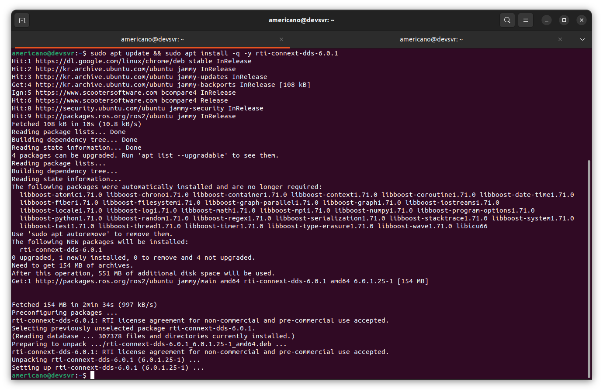
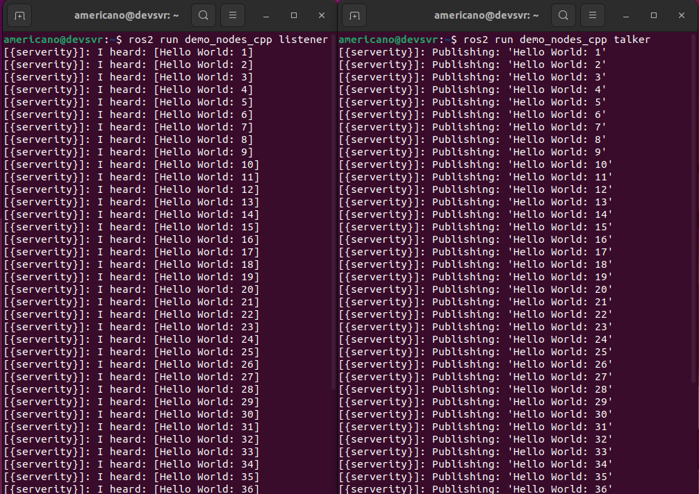
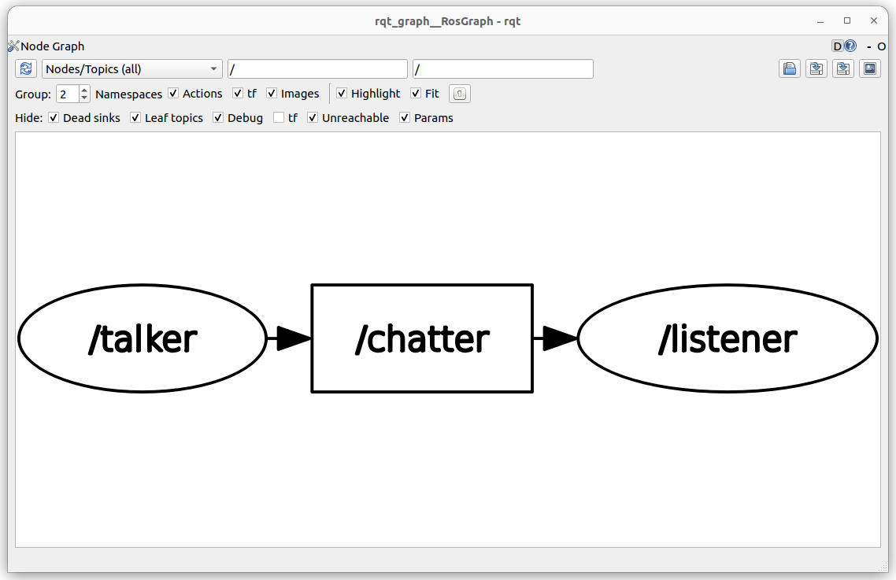
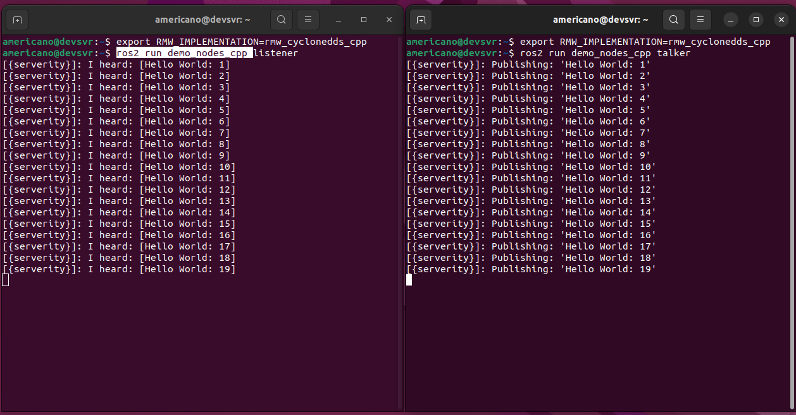
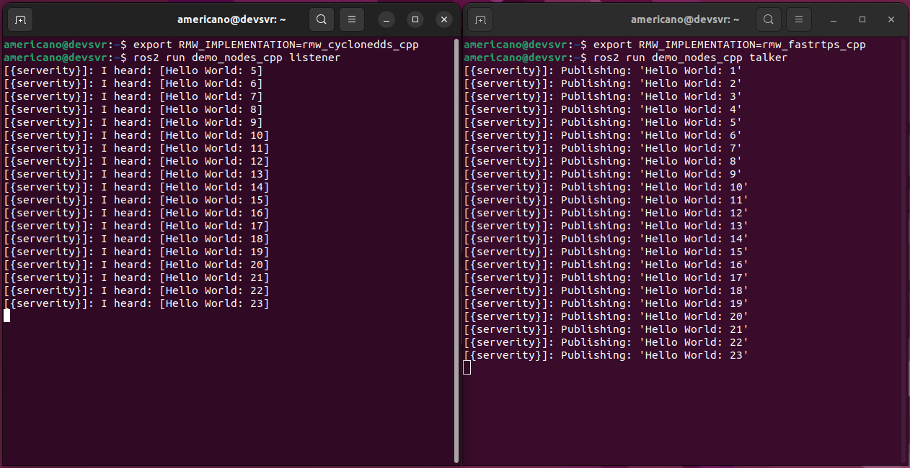
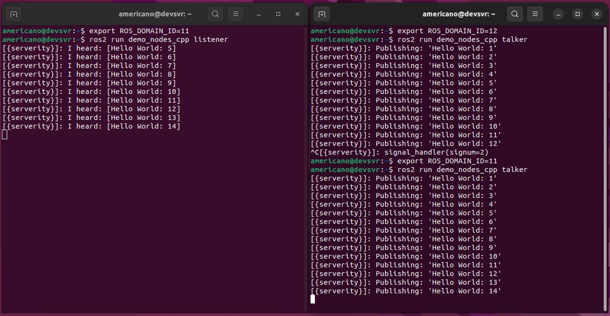
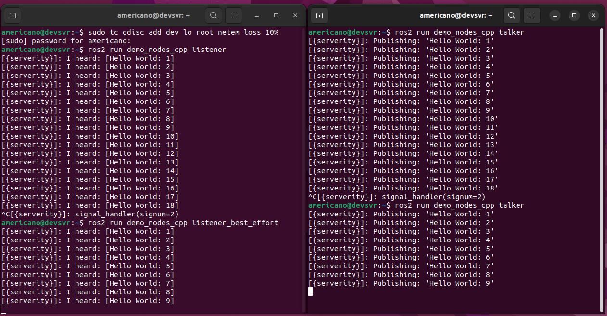

<!-- _class: lead -->

# **ROS2** Book study

#### [2nd] Week

###### Created by HanSop Kim ([@seobi](https://github.com/))

---

<!-- paginate: true -->

# 5. Why ROS 2?

**ROS2**의 중요 Concept으로 10가지 세부내용

```
1. 시장출시 시간 단축
2. 생산을 위한 설계
3. 멀티 플랫폼
4. 다중 도메인
5. 벤더 선택 기능
6. 공개 표준 기반
7. 자유 재량 허용 범위가 넓은 오픈소스 라이센스 채택
8. 글로벌 커뮤니티
9. 산업 지원
10. ROS 1과의 상호 운용성 확보
```

---

# 6. ROS1 vs ROS2

**ROS1**의 경우 초기 학술 분양에서 사용 되었지만, 차츰 상업적인 사용이 늘면서 특정 기능 및 추가적인 기능의 요구 사항이 필요하면서 기존 호환성을 유지하면서 새로운 기능 추가가 힘들며, 대규모 API 변경이 필요하면서 자연스럽게 ROS의 차세대 기능을 도입한 버전인 **ROS2**가 생겨났음.

---

# 6. ROS2 feature

```
- Platforms
- Real-time : DDS(RTPS:Real-time Publish-Subscribe Protocol)
- Security : TCPROS -> DDS,  DDS-Security / SROS 2
- Communication : DDS, QoS
- Middleware interface : RMW - support virtual API interface
- Node manager : roscore(ROS Master) -> DDS
- Languages :  C++14(C++17), python 3.5+
- Build system : catkin -> ament
- Build tools : colcon
- Build options : Multiple workspace, No non-isolated build, No devel space
- Version control system :  wstool -> vstool
- Client library
- Lifecycle , Multiple nodes, Threading model, Messages,
  Command Line Interface, Launch, Graph API, Embedded Systems
```

---

# 7. ROS2 and DDS

: install package of RMW




---

# 7. ROS2 and DDS

: DDS test with publisher and subscriber node
```
ros2 run demo_nodes_cpp listener
ros2 run demo_nodes_cpp talker
rqt_graph

```



---

# 7. ROS2 and DDS

: How to change RMW(ROS Middleware)
```
export RMW_IMPLEMENTATION=rmw_cyclonedds_cpp
ros2 run demo_nodes_cpp listener
export RMW_IMPLEMENTATION=rmw_fastrtps_cpp
ros2 run demo_nodes_cpp talker
```
: change Domain
```
export ROS_DOMAIN_ID=11
```




---

# 7. ROS2 and DDS

: QoS Test
```
sudo tc qdisc add dev lo root netem loss 10%
ros2 run demo_nodes_cpp listener
ros2 run demo_nodes_cpp talker
sudo tc qdisc delete dev lo root netem loss 10%
```
: Reliability BEST_EFFORT
```
ros2 run demo_nodes_cpp listener_best_effort
ros2 run demo_nodes_cpp talker
```


---
# 8. DDS of QoS

- Reliability
- History
- Durability
- Deadline
- Lifespan
- Liveliness

---

# 8. DDS of QoS

### History
1. Value
: KEEP_LAST / KEEP_ALL
2. RxO(Requested by Offered)
3. Example

```
[RCLCPP]
rclcpp::QoS(rclcpp::KeepLast(10));
[RCLPY]
qos_profile = QoSProfile(history=QoSHistoryPolicy.KEEP_LAST, depth=10)
```

---
# 8. DDS of QoS

### Reliability
1. Value
: BEST_EFFORT / RELIABLE
2. RxO(Requested by Offered)
3. Example
```
[RCLCPP]
rclcpp::QoS(rclcpp::KeepAll).best_effort();
[RCLPY]
qos_profile = QoSProfile(reliability=QoSReliabilityPolicy.BEST_EFFORT)
```

---
# 8. DDS of QoS

### Durability
1. Value
: TRANSIENT_LOCAL / VOLATILE
2. RxO(Requested by Offered)
3. Example
```
[RCLCPP]
rclcpp::QoS(rclcpp::KeepAll).transient_local();
[RCLPY]
qos_profile = QoSProfile(durability=QoSDurabilityPolicy.TRANSIENT_LOCAL)
```

---

# 8. DDS of QoS

### Deadline
1. Value
: deadline_duration
2. RxO(Requested by Offered)
3. Example
```
[RCLCPP]
rclcpp::QoS(10).deadline(100ms);
[RCLPY]
qos_profile = QoSProfile(depth=10, deadline=Duration(0.1))
```

---
# 8. DDS of QoS

### Lifespan
1. Value
: lifespan_duration
2. RxO(Requested by Offered)
3. Example
```
[RCLCPP]
rclcpp::QoS(10).reliable().transient_local().lifespan(10ms);
[RCLPY]
qos_profile = QoSProfile(lifespan=Duration(0.01))
```

---
# 8. DDS of QoS

### Liveliness
1. Value
: liveliness / lease_duration
2. RxO(Requested by Offered)
3. Example
```
[RCLCPP]
rclcpp::QoS qos_profile(10);
qos_profile.liveliness(RMW_QOS_POLICY_LIVELINESS_AUTOMATIC).liveliness_lease_duration(1000ms);
[RCLPY]
qos_profile = QoSProfile(liveliness=AUTOMATIC, liveliness_lease_duration=Duration(1.0))
```

---
# 8. DDS of QoS

### rmw_qos_profile

<style scoped>
table {
height: 50%;
width: 100%;
font-size: 70%;
color: blue;
}
th {
    color: yellow;
}
</style>
| Tables        | Default | Sensor Data | Service | Action Status | Parameters | Parameter Event  |
| ------------- | :-----: | :---------: | :-----: | :-----------: | :--------: | :--------------: |
| Reliability   |RELIABLE | BEST_EFFORT |RELIABLE | RELIABLE      | RELIABLE   | RELIABLE         |
| History       |KEEP_LAST| KEEP_LAST   |KEEP_LAST| KEEP_LAST     | KEEP_LAST  | KEEP_LAST        |
| Depth         | 10      | 5           | 10      | 1             | 1.000      | 1.000            |
| Durability    |VOLATILE | VOLATILE    |VOLATILE |TRANSIENT LOCAL| VOLATILE   | VOLATILE         |
