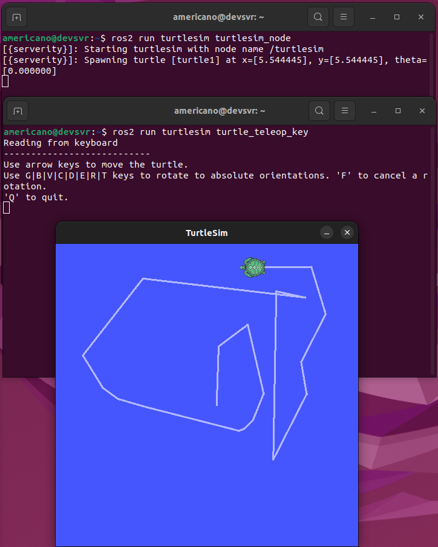
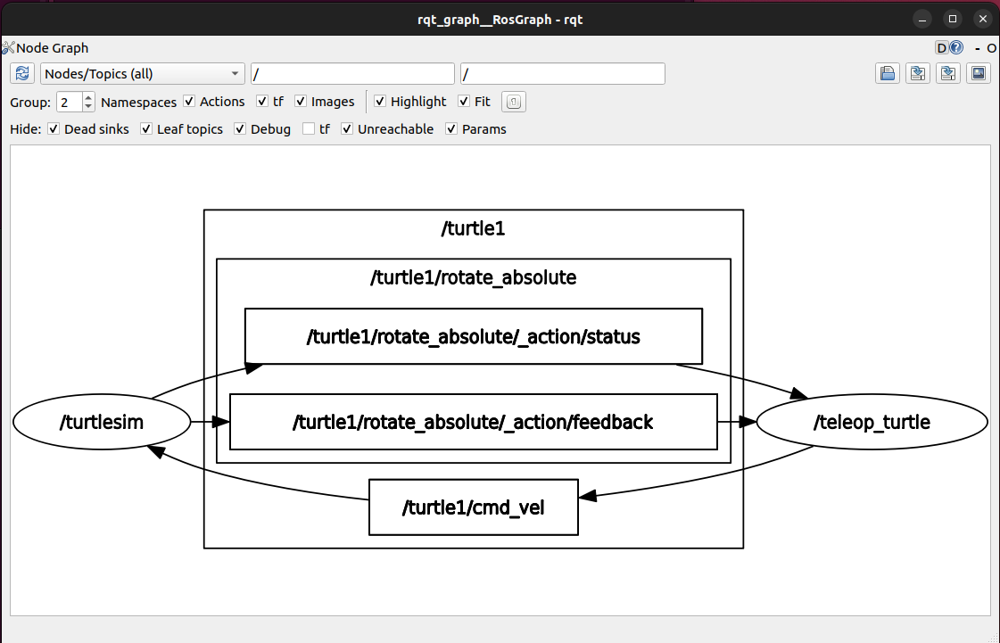
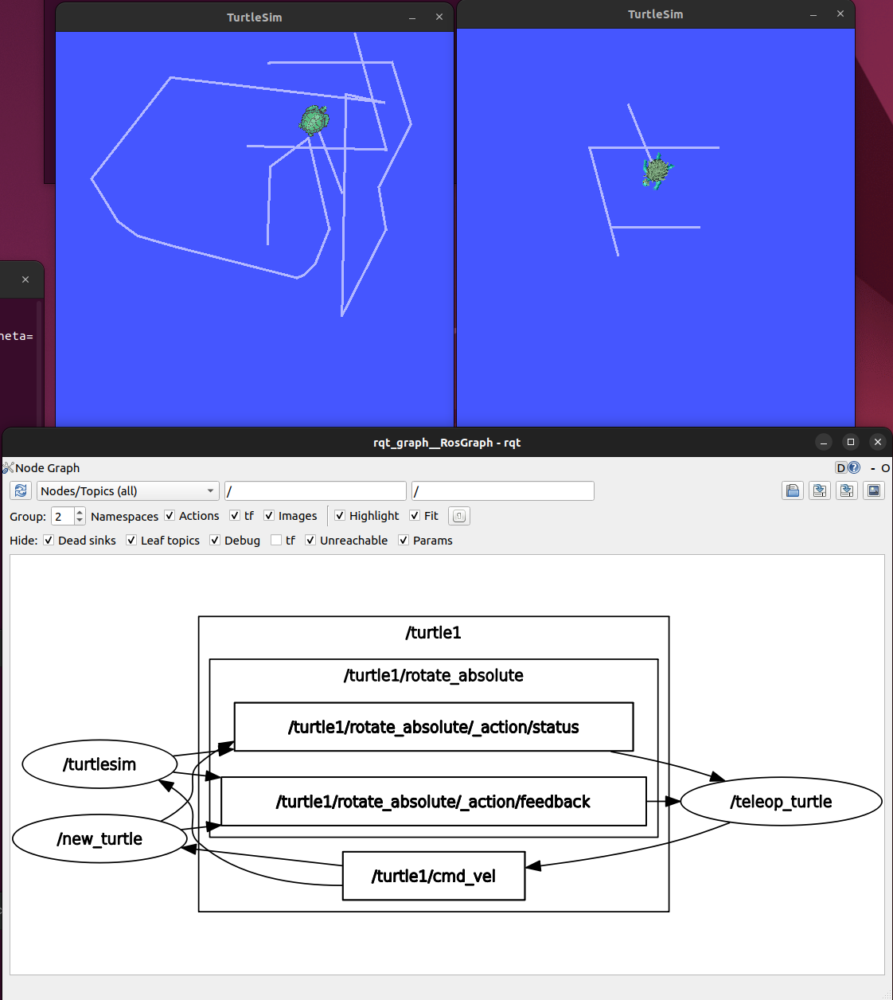
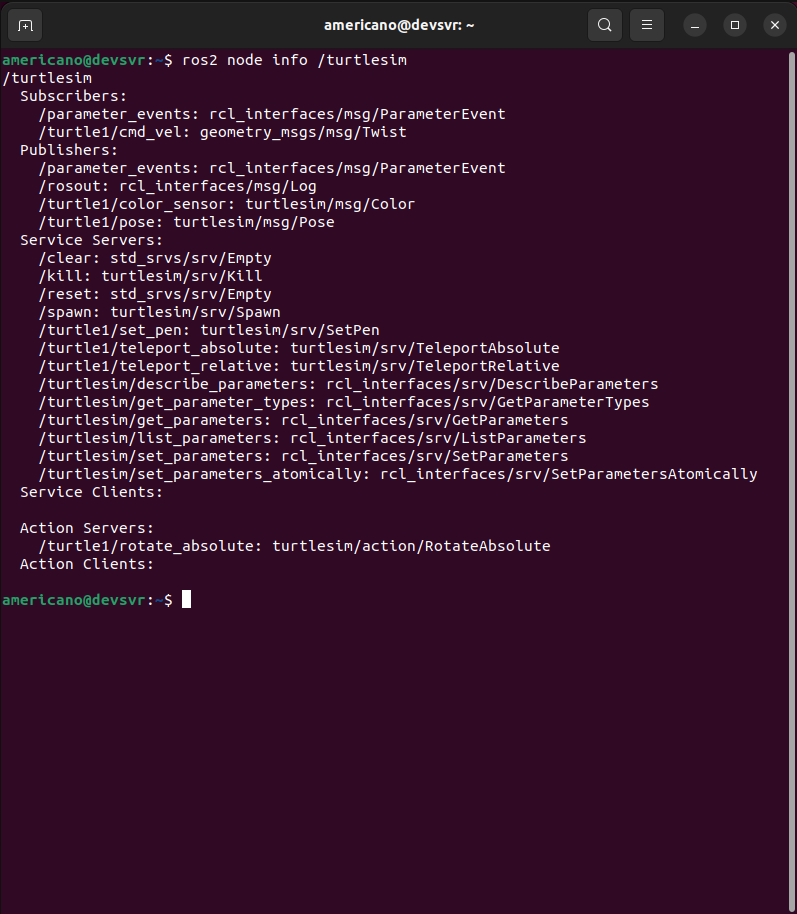
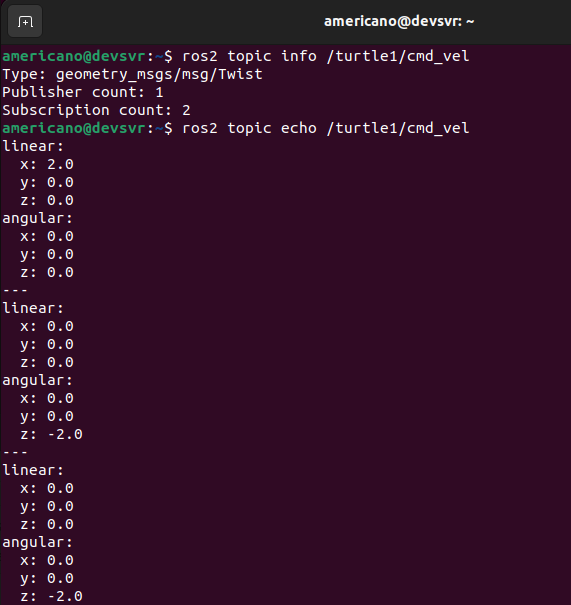
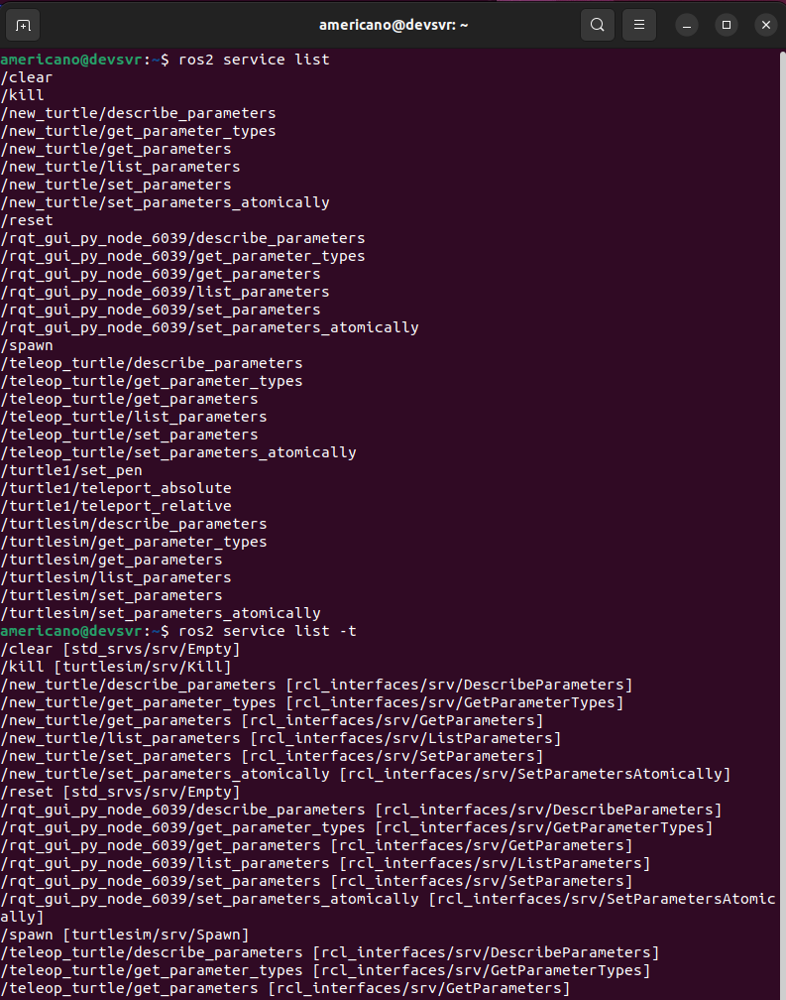

<!-- _class: lead -->

# **ROS2** Book study

#### [3rd] Week

###### Created by HanSop Kim ([@seobi](https://github.com/))

---

<!-- paginate: true -->

# 9. 패키지 설치와 노드 실행

**Turtlesim**

```
sudo apt update
sudo apt install ros-humble-turtlesim
```

---

# 9. Turtlesim 패키지의 노드 실행




---

# 9. rqt_graph로 보는 노드와 토픽의 그래프 뷰



---

# 10. ROS2 노드와 데이터 통신

: 토픽, 서비스, 액션, 파라미터

**노드 추가 하여 rqt_graph 확인**



---

# 10. 노드 정보

: 지정된 노드(turtlesim)의 Publishers, Subscriber, Service, Action, Parameter정보



---

# 11. ROS2 토픽

: 토픽 정보에 따라 1:N, N:1, N:N 가능
```
토픽 정보 확인
ros2 topic info /turtle1/cmd_vel
토픽 내용 확인
ros2 topic echo /turtle1/cmd_vel
```


---

# 12. ROS2 서버스


```
- 서비스 요청(Request)하는 쪽을 Service Client
- 요청받은 서비스를 수행한 후 서비스 응답(Response)하는 쪽을 Service Server
- 복수의 클라이언트를 가질수 있도록 설계
```

---

# 12. ROS2 서버스
```
서비스 목록 확인
ros2 service list
서비스 형태 확인
ros2 service list -t
```



