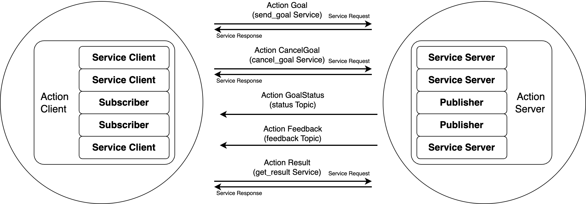
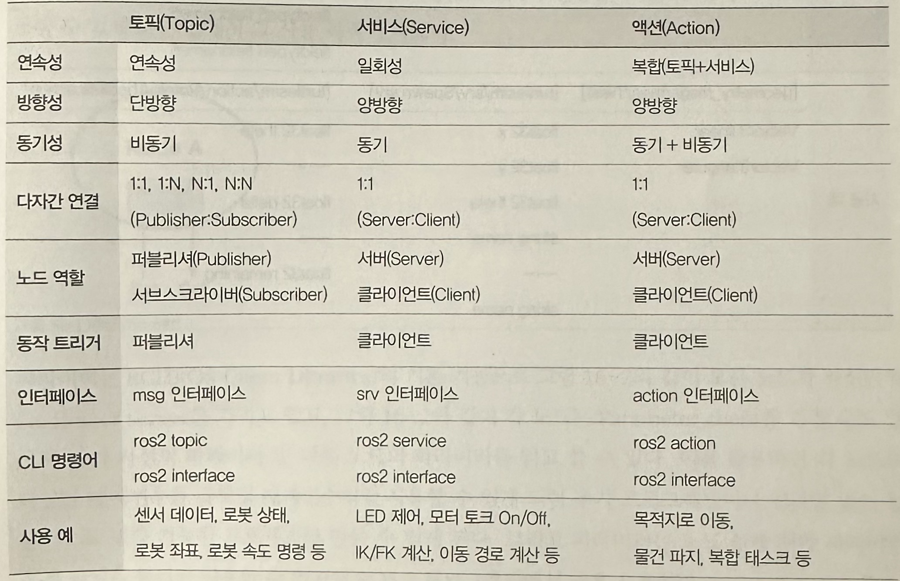
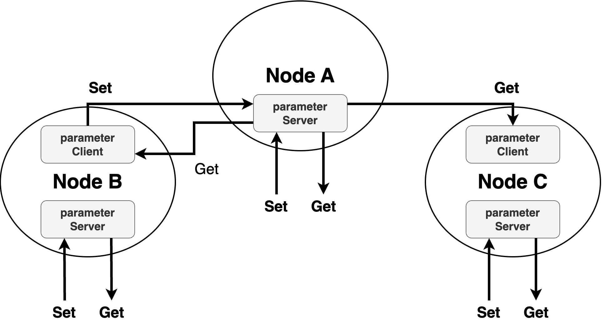

<!-- _class: lead -->

# **ROS2** Book study

#### [4th] Week

###### Created by HanSop Kim ([@seobi](https://github.com/))

---

<!-- paginate: true -->

# 13. ROS 2 액션

**Action Goal**
```
비동기식, 동기식 양방향 메지 송수신 방식
```
**Action Feedback**
```
특정 태스크를 수행하면서 중간 결괏값을 전송
```
**Action Result**
```
최종 결괏값 전송
```

---

# 13. ROS 2 액션



---

# 13. ROS 2 액션

```
$ ros2 action list -t
$ ros2 action info /turtle1/rotate_absolute
$ ros2 action send_goal <action_name> <action_type> "<values>"
```

---

# 14. ROS 2 인터페이스

- ROS2 인터페이스

- 메시지 인터페이스(Message interface, msg)
```
$ ros2 interface show geometry_msgs/msg/Twist
$ ros2 interface show geometry_msgs/msg/Vector3
```

---

# 14. ROS 2 인터페이스

- 서비스 인터페이스(Service interface, srv)
```
$ ros2 interface show turtlesim/srv/Spawn.srv
```
- 액션 인터페이스(Action interface, action)
```
$ ros2 interface show turtlesim/action/RotateAbsolute.action
```

---

# 15. ROS 2 토픽/서비스/액션 정리 및 비교



---

# 15. ROS 2 토픽/서비스/액션 정리 및 비교


---

# 16.  ROS 2 파라미터




---

# 16.  ROS 2 파라미터

- ros2 param list
```
$ ros2 param list
```
- ros2 param describe
```
$ ros2 param describe /turtlesim background_b
```
- ros2 param get
```
$ ros2 param get <node_name> <parameter_name>
```

---

# 16.  ROS 2 파라미터

- ros2 param set
```
$ ros2 param set <node_name> <parameter_name> <value>
```
- ros2 param dump
```
$ ros2 param dump /turtlesim
```
- ros2 param delete
```
$ ros2 param delete /turtlesim background_b
```

