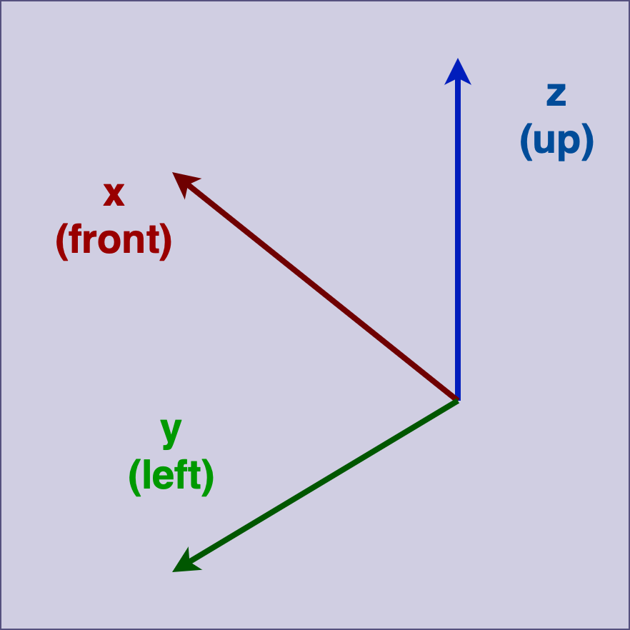

<!-- _class: lead -->

# **ROS2** Book study

#### [5th] Week

###### Created by HanSop Kim ([@seobi](https://github.com/))

---

<!-- paginate: true -->

# 17. ROS 2 도구와 CLI 명령어

**ROS 2 CLI 사용법**
```
$ ros2 [verb] [sub-verbs] [options] [arguments]
$ ros2 [tab] [tab] [tab] [tab] ...
$ ros -h
$ ros2 node -h
$ ros2 node info -h
```

---

# 17. ROS 2 도구와 CLI 명령어

**ROS 2 실행 명령어**

**ROS 2 정보 명령어**

**ROS 2 기능 보조 명령어**

---

# 18. ROS 2 GUI 개발을 위한 RQt

- ROS의 종합 GUI 툴 RQt
- RQt 프레임워크
- RQt 설치 및 실행
- RQt 플러그인의 종류
- RQt 사용 예시

---

# 19. ROS 2의 표준 단위

<style scoped>
table {
height: 50%;
width: 100%;
font-size: 70%;
color: blue;
}
th {
    color: yellow;
}
</style>
| 물리량          | 단위(SI unit) | 물리량             | 단위(SI derived unit) |
| :-----------: | :----------: | :---------------: | :-----------------: |
| Length(길이)   | Meter(m)     | Angle(평면각)       | Radian(rad)         |
| Mass(질량)     | Kilogram(kg) | Frequency(주파수)   | Hertz(Hz)           |
| Time(시간)     | Second(s)    | Force(힘)          | Newton(N)           |
| Current(전류)  | Ampere(A)    | Power(일률)         | Walt(W)             |
|               |              | Voltage(전압)       | Volt(V)             |
|               |              | Temperature(온도)   | Celsius(C)          |
|               |              | Magnetism(자기장)    | Tesla(T))           |

---

# 20 ROS 2의 좌표 표현

- ros 2의 좌표 표현 통일의 필요성
```
x forward, y left, z up을 기본 좌표계 사용
```

- 좌표 표현의 기본 규칙
```
삼차원 벡터표기 관습인 오른손 법칙을 따라 표현
```

---

# 20 ROS 2의 좌표 표현

- 좌표 표현의 축 방향(Axis Orientation) 규칙
```
1. 기본 3축
2. ENU 좌표
3. 접미사 프레임 사용(Suffix Frames)
```


---

# 20 ROS 2의 좌표 표현

- 좌표 표현의 회전 표현(Rotation Representation) 규칙
```
1. 쿼터니언(Quaternion)
2. 회전 매트릭스(Rotation matrix)
3. 고정축 roll, pitch, yaw(Fixed axis roll, pitch, yaw about X, Y, Z axes respectively)
4. 오일러 각도 yaw, pitch, roll(Euler angles yaw, pitch, and roll about Z, Y, X axes respectively)
```

